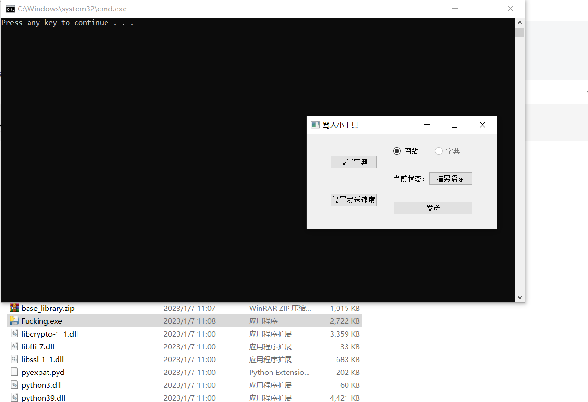
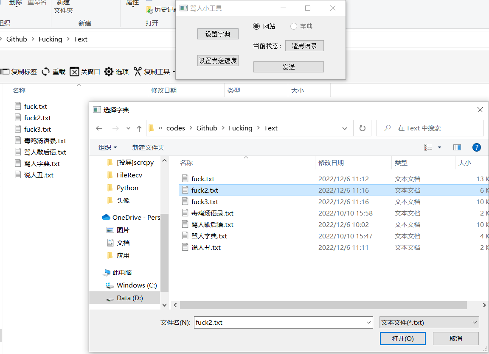

# <h1 align="center">Fucking TOOL</h1>

一个调用网页API或者本地词库进行骂人的 *Python* 自动骂人工具!!!不定时更新 *词库*  !!!

> 功能: 可选择夸人、骂人,句子可从文本文档导入,也可直接用骂人网站里的句子.

### Quick Start

#### 方式1:直接运行Pyw脚本(**确保您电脑上有Python**)

> > **运行前请安装依赖库(pip install +库名)**
> >
> > - PyQt5
> > - lxml
> > - requests
> > - pynput
> > - pyperclip
> >
> > Git clone 或者 Download zips 文件夹 *Python* 至本地
>
> 双击 **运行.pyw** 运行,开启后点击要发送的文本框,自动发送(发送按键设置为 **回车键** )

#### 方式2:运行exe文件(适合小白)

> 不需要电脑安装 Python ,在 *Windows* 上可以直接使用.
>
> Git clone 或者 Download zips 文件夹 *Pake/EXE* 至本地
>
> > 双击 **Fucking.exe** 运行,随便在 **CMD命令行页面** 输入一个字符,
> >
> > 开启后点击要发送的文本框,自动发送(发送按键设置为 **回车键** )

### 屏幕截图

### The Others

修改自：[turnflowerdown/superFuck ](https://github.com/turnflowerdown/superFuck)(**已从原项目中分离**)

赞助地址：[Mr.eAt/爱发电](https://afdian.net/a/MreAt) (**￥5.00** 起)

> GitHub [@wjkcxs](https://github.com/wjkcxs) Gitee [@wjkcxs](https://gitee.com/wjkcxs)

